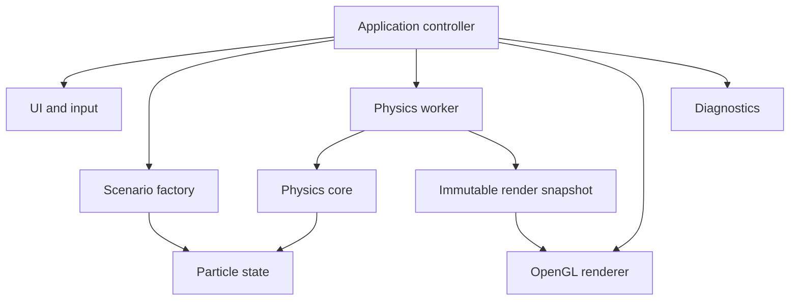

# Gravity architecture

Status: implementation baseline  
Last updated: 2026-08-04

## 1. Architectural goals

Gravity is designed around four properties:

1. numerical behaviour can be checked independently from graphics;
2. the UI remains responsive while physics is expensive;
3. particle count does not create an equal number of Python or UI objects;
4. the intensive backend can change later without rewriting the application.

Correctness is established with a small exact solver first. Barnes-Hut is an
optimization that must prove both its error and its speed against that reference.

## 2. System shape



The application controller owns lifecycle and commands. It does not implement
forces, draw particles, or generate a galaxy itself.

## 3. Package boundaries

```text
src/gravity/
├── __init__.py
├── app/          lifecycle, command routing, worker coordination
├── core/         configuration, state contracts, snapshots, validation
├── diagnostics/  logging, timings, counters, environment report
├── physics/      direct and Barnes-Hut solvers, integrator, invariants
├── rendering/    OpenGL resources, shaders, camera, post-processing
├── scenarios/    deterministic initial-state generation
└── ui/           Dear ImGui panels, presentation state, input mapping
```

Dependency rules:

- `core` depends only on the standard library and NumPy types.
- `physics` depends on `core`, NumPy, and Numba; never on UI or OpenGL.
- `scenarios` depends on `core` and numerical helpers, not on rendering.
- `rendering` consumes render snapshots and never mutates physics state.
- `ui` emits validated commands; it does not call solver internals directly.
- `app` is the composition root and may connect all components.
- `diagnostics` receives measurements through small interfaces; hot numerical
  loops never log per particle or per tree node.

Circular imports are architecture failures.

## 4. Process and thread model

Gravity V1 uses one process and two principal threads:

### Main thread

- owns GLFW, the OpenGL context, Dear ImGui, and all GPU resources;
- polls input and draws the latest complete snapshot;
- sends immutable commands to the physics worker;
- never waits indefinitely for a physics step.

### Physics worker

- is the only writer of live physics state;
- consumes commands at explicit safe points;
- advances a fixed-step simulation with Numba kernels that release the GIL;
- publishes complete snapshots through a queue with capacity one;
- never touches OpenGL or Dear ImGui.

This model is implemented at step 7 by `PhysicsWorker`, `RenderSnapshot`, and
`SimulationStatus`. The snapshot queue holds at most one presentation copy: a
newer state atomically replaces an unconsumed older copy.

Commands are values such as `Pause`, `Resume`, `SingleStep`, `Reset`,
`SetExperiment(config)`, and `SetTimeScale`. `ExperimentConfig` contains the
scenario kind, Barnes-Hut particle count, and random seed. New scenario
configuration replaces this whole validated object rather than mutating shared
fields piecemeal.

Barnes-Hut is the only automatic startup mode and uses 10,000 particles by
default. The exact solver is an explicit advanced comparison command and has a
hard 1,000-particle ceiling. Barnes-Hut experiments may request 100 to 50,000
particles.
Switching backend creates the same seeded scenario at the safe active count
rather than mutating a live solver behind the integrator; returning restores the
full requested Barnes-Hut count.

If the renderer is faster than physics it reuses the newest snapshot. If physics
is faster, old unpublished snapshots may be dropped; physics state itself is
never dropped. This favours responsiveness and bounded memory.

## 5. Particle-state contract

Physics uses a structure-of-arrays representation:

| Field | Shape | Type | Owner |
|---|---:|---|---|
| positions | `(N, 3)` | `float64`, C-contiguous | physics worker |
| velocities | `(N, 3)` | `float64`, C-contiguous | physics worker |
| accelerations | `(N, 3)` | `float64`, C-contiguous | physics worker |
| masses | `(N,)` | `float64`, C-contiguous | physics worker |
| ids | `(N,)` | `uint64` | physics worker |

Optional render attributes are derived separately. There is no Python `Star`
object and no graphics object per particle.

State invariants:

- all arrays have the same particle count;
- all physics values are finite;
- masses are strictly positive;
- arrays have the documented shape, dtype, and contiguous layout;
- the solver cannot resize arrays during a step;
- a published snapshot is read-only from the renderer's perspective.

The render snapshot contains positions converted to `float32`, stable IDs, and
only the attributes required by the active colour/size mode. At 10,000 particles
this copy is small and prevents the GPU from reading arrays while physics writes
them.

## 6. Units and force model

V1 uses dimensionless internal units and sets `G = 1`. This avoids mixing metres,
solar masses, years, and display scale before the model needs real-world units.
Every scenario defines characteristic mass, length, and time scales in metadata
so physical presentation units can be added later.

For particles `i` and `j`, softened acceleration follows the Plummer form:

```text
a_i += G * m_j * (r_j - r_i) / (|r_j - r_i|^2 + epsilon^2)^(3/2)
```

Softening prevents singular acceleration at zero separation. It is a physical
model parameter, not merely an exception handler, and must be recorded in every
benchmark and reproducible configuration.

Self-gravity and optional analytic background potentials are separate force
providers. This lets the first galaxy use a documented halo/bulge potential for
stable rotation without corrupting exact-vs-Barnes-Hut comparisons.

## 7. Integration pipeline

The fixed-step integrator is kick-drift-kick leapfrog:

1. compute initial acceleration for a new state;
2. half kick: `v += 0.5 * dt * a`;
3. drift: `x += dt * v`;
4. rebuild the spatial tree from the new positions when Barnes-Hut is active;
5. compute new acceleration;
6. half kick: `v += 0.5 * dt * a`.

The simulation time step is independent from wall-clock frame time. A time-scale
setting controls how aggressively the worker advances the simulation but never
changes `dt` silently. A maximum work budget per UI frame prevents a backlog from
making the interface unresponsive.

Adaptive time stepping is outside V1. It can be added only with new conservation
tests and a recorded architecture decision.

## 8. Solver interface

Solvers implement one conceptual operation:

```text
accelerations = solver.compute(positions, masses, softening, output_buffer)
```

The concrete API may use in-place buffers for speed, but callers do not depend on
tree internals.

### Exact reference solver

- symmetric direct summation in `O(N^2)`;
- Numba-compiled loops, not an `(N, N, 3)` temporary array;
- each pair is evaluated once and contributes equal/opposite force;
- intended for tests and small interactive systems, not the 10,000 default.

This boundary is implemented at step 4 by `ExactGravitySolver`, operating on a
validated `ParticleState`. The compiled kernels deliberately avoid fast-math so
the exact engine remains a conservative comparison oracle. Its softening,
fixed-step integration, and invariant checks are documented in
`PHYSICS_REFERENCE.md`.

### Barnes-Hut solver

- 3D octree rebuilt for each force evaluation;
- contiguous flat arrays rather than recursive Python node objects;
- iterative traversal in compiled code;
- configurable opening angle theta;
- leaf buckets and a maximum depth prevent infinite subdivision for coincident
  or nearly coincident particles;
- each node stores bounds, total mass, centre of mass, children, and leaf range;
- instrumentation separates tree build and force traversal time.

No multipole order beyond centre of mass is required for V1.

This boundary is implemented at step 6 by `FlatOctree`, `build_octree`, and
`BarnesHutSolver`. The compiled traversal always opens a node whose nested
particle range contains the target, preventing self-attraction. Sequential and
parallel kernels share the same target traversal and therefore produce bitwise
identical outputs. Accuracy and benchmark evidence are documented in
`BARNES_HUT.md`.

## 9. Galaxy scenario

The default generator is deterministic from a configuration plus seed. It
produces:

- an exponential disk with configurable radius and thickness;
- a denser central bulge;
- optional central mass;
- an optional analytic halo potential;
- tangential velocities derived from an approximate enclosed-mass rotation
  curve;
- small, seeded velocity dispersion;
- zeroed global centre-of-mass position and bulk velocity.

Generation and dynamics are tested separately. A scenario test checks
distribution statistics, finiteness, determinism, centre-of-mass correction, and
initial radial-force/velocity consistency. Visual beauty alone is not a test.

This boundary is implemented at step 5 by `GalaxyConfig`,
`generate_spiral_galaxy`, `GalaxyMassModel`, and immutable component labels kept
beside the mutable `ParticleState`. The analytic Plummer halo implements a
separate additive field; `CompositeGravitySolver` combines it explicitly with a
self-gravity backend without changing either model. The exact short-run gate
and default-seed distribution measurements are documented in
`GALAXY_MODEL.md`.

## 10. Rendering pipeline

The compatibility target is an OpenGL 3.3 core context.

- GLFW creates the window and context.
- ModernGL owns shaders, buffers, vertex arrays, framebuffers, and draw calls.
- all base particles are submitted in one point draw from a contiguous GPU
  buffer;
- the vertex shader applies the camera transform and computes point size;
- the fragment shader produces circular, soft-edged point sprites;
- additive glow and trails use optional passes with explicit timing;
- the renderer uploads only when a new snapshot is available;
- the vertex shader consumes physical positions directly and applies no
  independent animation or rotation;
- resize and DPI changes update viewport and projection without rebuilding
  physics state.

Compute shaders are not used in V1, even when the GPU supports them. OpenGL 3.3
keeps the first renderer compatible and leaves GPU physics as a later backend.

Camera state is presentation-only. Orbit uses a focus point and quaternion or
stable yaw/pitch representation; pan is scaled to camera distance; zoom is
bounded to avoid crossing the focus point.

## 11. UI architecture

Dear ImGui Bundle provides controls and GLFW integration in the same OpenGL
context. The UI layer owns presentation state, tooltips, layout, and localization.
It converts widgets into validated application commands.

The initial layout is:

- full-window 3D viewport;
- collapsible right control panel;
- compact performance overlay;
- basic controls visible, advanced physics folded;
- modal progress/error surfaces only when necessary.

At step 7 the advanced section is closed by default. It identifies Barnes-Hut as
the normal backend and requires a deliberate button press to regenerate a
1,000-particle exact comparison. Returning to Barnes-Hut restores 10,000
particles.

UI and camera event routing honours ImGui input-capture flags. Dragging a slider
must never orbit the camera.

User-facing strings are centralized from the first UI implementation. French is
the only required V1 translation, but strings are not scattered through solver
or renderer code.

## 12. Configuration and local data

Source defaults are immutable. User data is written below a per-user Gravity
directory, planned as `%LOCALAPPDATA%\Gravity` on Windows:

```text
Gravity/
├── settings.json
├── logs/
├── screenshots/
└── cache/          # disposable Numba/application cache when applicable
```

Configuration is versioned and validated before use. Unknown future keys are
ignored safely; invalid or unreadable files are renamed for diagnosis and
replaced with defaults. Atomic write-then-replace prevents partial JSON files.

No runtime network access or telemetry is required.

## 13. Diagnostics and failure handling

- The application installs a top-level exception boundary before graphics setup.
- Startup checks report Python architecture, package versions, OS, GPU renderer,
  and OpenGL version without collecting user documents or credentials.
- Logs rotate by size and count.
- Expected validation failures become French UI messages.
- Unexpected failures show a short message plus the exact local log path.
- Worker exceptions are marshalled to the main thread and reach the top-level
  user-feedback boundary rather than disappearing silently.
- Per-particle, per-pair, and per-node logging is forbidden in normal runs.

## 14. Verification architecture

Tests are divided by purpose:

```text
tests/
├── unit/          validation, state, math, camera
├── physics/       analytic systems, invariants, solver comparison
├── integration/   commands, lifecycle, snapshots, persistence
└── smoke/         startup and graphics on supported hardware

benchmarks/        reproducible performance and accuracy measurements
```

Physics tests do not import GLFW, Dear ImGui, or ModernGL. Most application tests
run without a GPU. Graphics smoke tests are explicitly marked because a real
context is required on Windows. Performance benchmarks report results but are
not ordinary pass/fail unit tests; release budgets are evaluated from their
saved summaries.

The quality toolchain planned for step 2 is Pytest, Ruff, coverage, and type
checking at module boundaries. Numba kernels receive focused numerical tests
rather than being contorted solely to satisfy static typing.

## 15. Compatibility gates and fallbacks

The selected packages have current Windows wheels and support the planned Python
runtime, but the real target PC remains the decisive environment.

1. Step 2 verifies Python, NumPy, and Numba installation and a non-graphical
   compiled smoke calculation.
2. Step 3 verifies GLFW + Dear ImGui Bundle + ModernGL together before building
   the full renderer.
3. If Dear ImGui Bundle has a reproducible installation/backend failure, the
   fallback is the narrower GLFW + maintained Dear ImGui binding combination;
   the physics and rendering contracts remain unchanged.
4. If Python/Numba misses a measured performance gate, profiling identifies the
   smallest backend boundary to replace. No language rewrite is authorized by a
   hunch alone.

## 16. Non-negotiable rules

- No Python object, UI widget, or draw call per particle.
- No `O(N^2)` collision pass in the interactive engine.
- No variable physics step tied to frame time.
- No UI or OpenGL import inside physics.
- No hidden parameter change during a run.
- No optimization without an accuracy comparison and benchmark.
- No swallowed worker exception or console-only user error.
- No expansion of V1 scope without updating the specification and roadmap.
