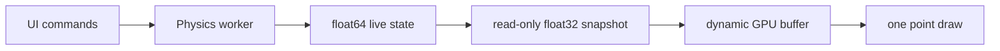

# Physics/render coupling — step 7

Step 7 removes the last visual-only motion from Gravity. Every visible position
now comes from the seeded galaxy, leapfrog integration, the analytic halo, and
one selected self-gravity solver.

## Runtime data flow

GLFW, Dear ImGui, ModernGL, the camera, and GPU resources stay on the main
thread. `PhysicsWorker` is the only owner and writer of the live `ParticleState`.
It advances a fixed `0.02` leapfrog step and never reads frame delta as a physics
time step.

The main thread polls a queue with capacity one. When no new snapshot is ready,
it draws the previous complete state again. When physics publishes faster than
rendering consumes, the superseded presentation copy is dropped. A physics
step, particle, or command is never dropped.

Each snapshot contains a C-contiguous `float32 (N, 3)` position copy and a small
status value. Step 9 extends it with compact read-only observation arrays for
colouring and statistics. The renderer
updates the single interleaved GPU buffer only for a new snapshot and retains
one particle-field draw call. The optional centre-of-mass marker uses one extra
single-point draw. The step-3 shader rotation and `u_time` uniform no longer exist.

## Commands and scheduling

The worker consumes typed commands only between complete steps:

- pause and resume;
- one fixed step while paused;
- deterministic reset;
- time scale from `0.1x` to `2.5x` without changing the fixed step;
- explicit backend switch;
- atomic experiment replacement (scenario, Barnes-Hut count, and seed);
- bounded clean shutdown.

At `1.0x`, the scheduler targets one `0.02` simulation step per `0.02` wall
second. It limits catch-up debt to four steps so a slow machine cannot build an
ever-growing backlog that makes the UI unresponsive.

Reset and backend changes increment a generation number and build a fresh state
from the same default seed. Pause and speed survive that regeneration.

## Backend policy

Barnes-Hut is constructed automatically at every application start:

| Mode | Access | Particles | Purpose |
|---|---|---:|---|
| Barnes-Hut | automatic default | 100–50,000; 10,000 default | normal interactive simulation |
| Exact `O(N²)` | advanced section, explicit button | at most 1,000 | reference comparison |

The advanced section is collapsed by default. There is no startup prompt and no
ordinary control that can accidentally select the exact backend. Its particle
limit is enforced inside `PhysicsWorker`, not merely in the button label.
Returning to Barnes-Hut regenerates the selected scenario at its requested count.

Both modes use the same scenario kind, seed, scenario-specific analytic fields,
leapfrog integrator, softening, and fixed time step. Only the safe active count
and particle self-gravity backend change.

## Failure and ownership rules

- the worker catches its thread boundary and retains the original exception;
- the main thread polls for failure every frame and relays it to the existing
  application error boundary and local log;
- shutdown signals the worker and waits at most five seconds;
- physics stops before GPU, ImGui, context, and window resources are released;
- no UI or OpenGL object crosses into the worker.

## Automated evidence

The step-7 suite validates immutable snapshots, bounded replacement, command
routing, default mode, exact-mode ceiling, pause/resume/single-step/reset,
backend regeneration, time scale, renderer uploads and resizing, failure relay,
and resource-release order.

A warmed real-engine smoke in the validation container produced:

| Check | Result |
|---|---:|
| Startup backend | Barnes-Hut |
| Startup particles | 10,000 |
| Initial snapshot latency | 23.30 ms |
| Last measured physical step | 13.35 ms |
| Position change after four steps | 0.054089 maximum absolute coordinate |
| Finite positions | yes |
| Short coupled soak | 100 steps / 2.0 simulated units, all finite |
| Radius after short soak | 2.8745 median / 10.8654 maximum |
| Exact comparison | 1,000 particles, 8.81 ms for one warmed step |
| Return from exact | Barnes-Hut, 10,000 particles, pause preserved |

These timings are evidence for that Linux container, not a performance promise
for a particular Windows CPU. The target-PC validation remains deliberately
short and is recorded in `STEP7_VALIDATION.md`.
